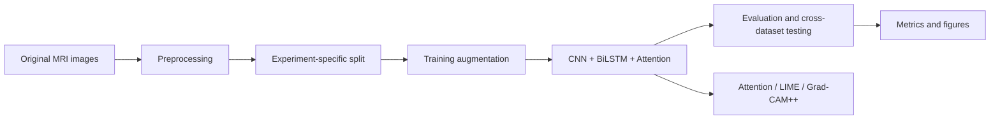

# Research workflow

```mermaid
flowchart LR
 A[Original MRI images] --> B[Preprocessing]
 B --> C[Experiment-specific split]
 C --> D[Training augmentation]
 D --> E[CNN + BiLSTM + Attention]
 E --> F[Evaluation and cross-dataset testing]
 F --> G[Metrics and figures]
 E --> H[Attention / LIME / Grad-CAM++]
```

This is a conceptual overview. The historical C split-after-augmentation exception is documented in experiment_notes.md.
